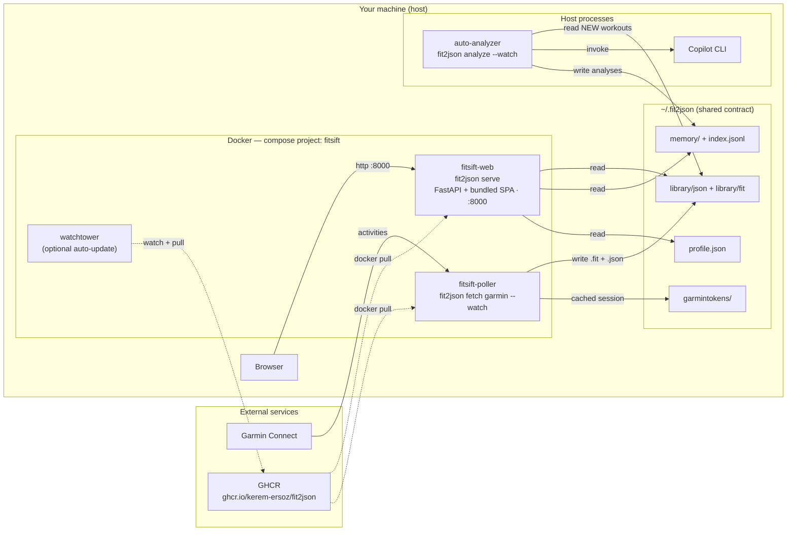
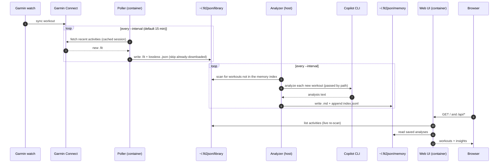
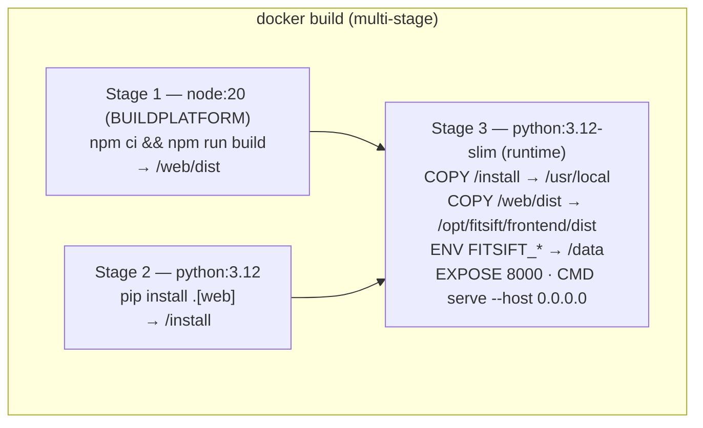
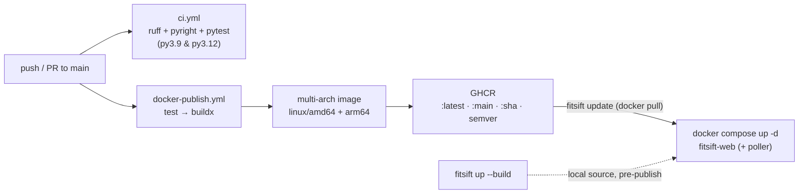
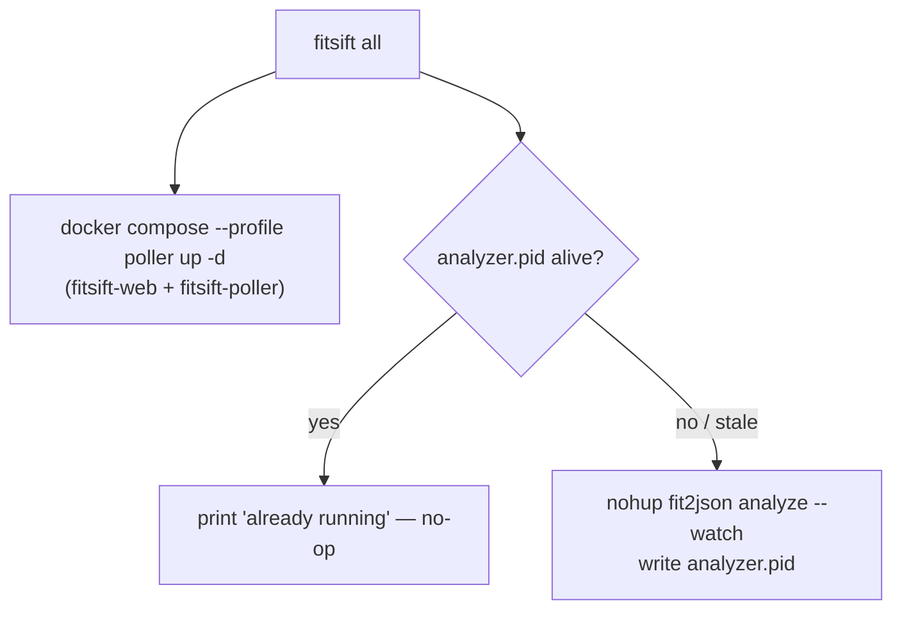
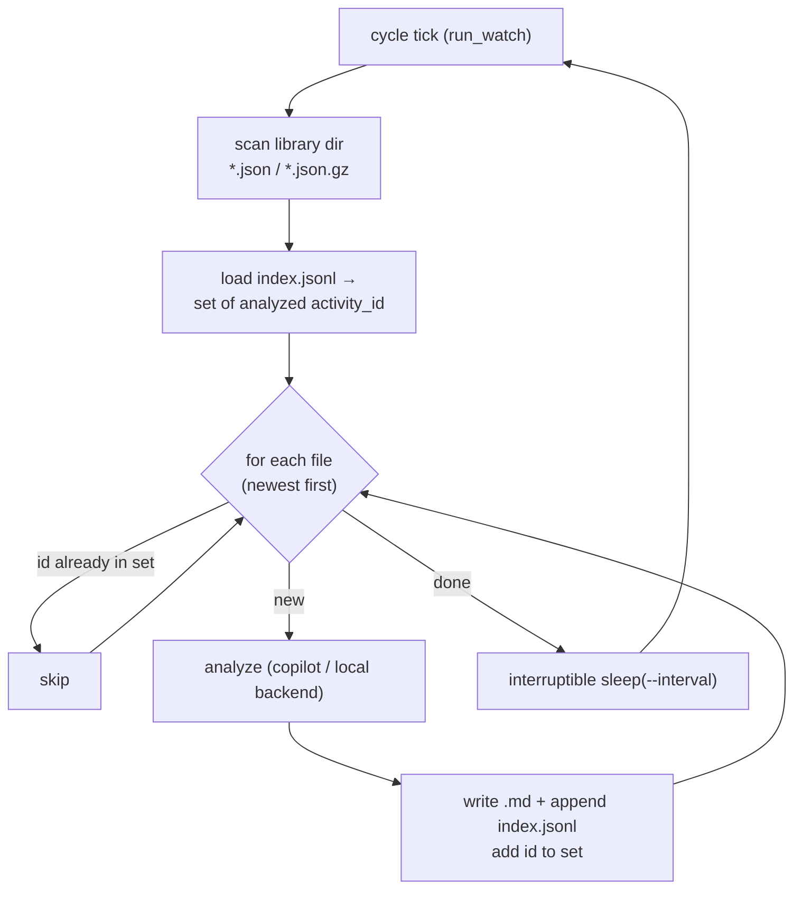
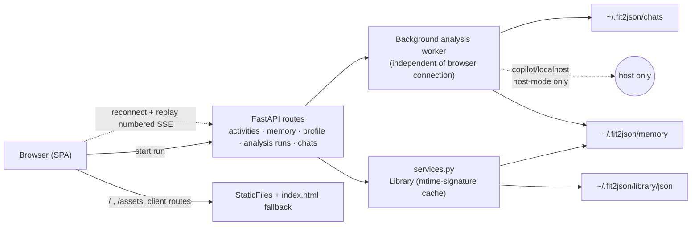

# FitSift architecture

How the pieces we run locally fit together: the `fit2json` CLI, the FitSift web UI, the
container image, and the pull‑and‑run pipeline that ties them into a hands‑off
"workout → insight" loop.

- **CLI reference & usage:** [README.md](README.md)
- **Product / design intent:** [PRODUCT.md](PRODUCT.md), [DESIGN.md](DESIGN.md)

---

## 1. The big picture

`fit2json` has three stages — **fetch/convert → store (lossless JSON) → analyze (LLM,
saved to a memory corpus)** — plus a **FitSift web UI** that browses the results. Running
it locally as a self‑updating loop means three long‑lived roles:

1. **Poller** — pulls new Garmin activities into a local library.
2. **Analyzer** — turns each new workout into a saved analysis.
3. **Web UI** — serves the backend API + React SPA to read it all.

The defining constraint: **analysis needs the Copilot CLI on the host** (and the
`ollama`/`lmstudio` backends resolve to `localhost`), so it **cannot run inside the
container**. That single fact shapes the whole topology — the poller and UI run as
containers, the analyzer runs on the host, and the three coordinate **only through the
shared `~/.fit2json` directory** (no IPC, no network between them).



---

## 2. Components

| Component | Runtime | Entry point | Reads | Writes |
|-----------|---------|-------------|-------|--------|
| **Web UI** (FitSift) | container `fitsift-web` | `fit2json serve --host 0.0.0.0` | `library/json`, `memory/`, `profile.json`, `chats/` | `memory/`, `profile.json`, `chats/` |
| **Poller** | container `fitsift-poller` | `fit2json fetch garmin --watch` | Garmin Connect, `garmintokens/` | `library/fit`, `library/json` |
| **Auto-analyzer** | **host** process | `fit2json analyze --watch` | `library/json`, `memory/index.jsonl` | `memory/` |
| **Copilot CLI** | **host** | `copilot` (invoked by analyzer) | workouts by path, `memory/` | — (returns text) |
| **Watchtower** | container (optional) | `containrrr/watchtower` | GHCR | recreates labelled containers |

All three long‑lived roles are managed by `scripts/fitsift` (see §7).

---

## 3. Data flow: workout → insight

The three roles never call each other — each observes the shared filesystem and reacts.
The web app re‑scans the library on every request (invalidating a cache keyed on each
file's `(path, mtime, size)`), so a workout the poller drops in appears on the next page
load with no restart.



---

## 4. The shared contract: `~/.fit2json`

Everything is coupled through this one directory (mounted into the containers at `/data`,
read/written directly by the host processes):

```
~/.fit2json/
├── library/
│   ├── fit/            # raw .fit archive (permanent)        ← poller --raw-dir
│   └── json/           # one lossless JSON per activity       ← poller -o / UI library
├── memory/             # analysis corpus (per-sport .md)      ← analyzer / UI Memory tab
│   └── index.jsonl     # one line per analysis (dedup + recall key)
├── chats/              # saved conversations                  ← UI chat pane (resume later)
│   └── .analysis-runs/ # durable run ids/status (retry dedup)
├── garmintokens/       # cached Garmin session (GARMINTOKENS) ← poller
├── profile.json        # athlete "You" profile                ← UI / analyzer personalization
├── logs/analyzer.log   # host analyzer output                 ← scripts/fitsift
└── analyzer.pid        # host analyzer PID (idempotency)      ← scripts/fitsift
```

Container env maps the web app onto these paths: `FITSIFT_LIBRARY=/data/library/json`,
`FITSIFT_MEMORY=/data/memory`, `FITSIFT_PROFILE=/data/profile.json`,
`FITSIFT_CHATS=/data/chats`.

---

## 5. The container image

A single multi‑stage `Dockerfile` produces a web‑capable image. The frontend stage is
pinned to the **build** platform (`$BUILDPLATFORM`) so the static SPA isn't rebuilt under
slow arm64 emulation; only the Python/runtime layers are per‑architecture.



The image keeps `ENTRYPOINT ["fit2json"]`, so the same image runs **any** subcommand:
`serve` (web), `fetch garmin --watch` (poller), `convert`, etc. `analyze --backend copilot`
is the exception — it needs the host CLI.

---

## 6. Build & publish pipeline

CI gates every push, then publishes a multi‑arch image to GHCR that the local pipeline
pulls.



> Until this lands on `main` and CI republishes, GHCR `:latest` is the older **CLI‑only**
> image. Use `./scripts/fitsift up --build` (or `all`, which builds if needed) meanwhile;
> `./scripts/fitsift update` is the steady‑state "pull latest + restart".

---

## 7. Orchestration: one command, idempotent

`scripts/fitsift` wraps `docker compose` **and** the host analyzer so the whole pipeline is
one command. Because analysis is host‑side, `all` starts two containers plus one
backgrounded host process:

```
./scripts/fitsift all     # UI + poller (containers) + analyzer (host)
./scripts/fitsift stop     # stop all three
./scripts/fitsift status   # every component (compose ps + analyzer PID)
```

**Idempotency** — safe to re‑run without checking:

- **Containers:** `docker compose up -d` reconciles to desired state; re‑running is a no‑op
  unless config changed.
- **Analyzer:** guarded by `analyzer.pid` + a `kill -0` liveness check — a second `up`
  prints "already running" and starts nothing; a stale PID file self‑heals (restarts).
- **Work:** the analyzer de‑duplicates against the memory index, so it never re‑analyzes a
  workout already in the corpus — no duplicate analyses or redundant Copilot calls.



---

## 8. `analyze --watch`: incremental & de‑duplicated

The auto‑analyzer reuses the same built‑in scheduler as `fetch --watch`
(`fit2json/watch.py`), but each cycle it processes **new** workouts individually and saves
each to the memory corpus. Dedup is by `activity_id` (derived from start time + source
file) looked up in `index.jsonl`; a failed workout is logged and retried next cycle rather
than killing the loop.



Saved analyses carry their `(backend, model, reasoning_effort)` tier, so the web UI's
multi‑workout comparison can **reuse** a host‑generated building block instead of
re‑running it.

---

## 9. Web request flow

The FastAPI app mounts the JSON API under `/api` and serves the built SPA for everything
else (with an `index.html` fallback for client‑side routes). Interactive analysis uses a
server-owned run: `POST /analysis-runs` starts one worker, and numbered SSE events can be
replayed after a browser disconnect without restarting inference. Chat runs persist their
running/terminal state and assistant result in `chats/`; single-workout runs save to
`memory/`. Small run markers under `chats/.analysis-runs/` keep POST retries idempotent
across server restarts. A restart cannot resume model inference, so any run left active is
converted to an explicit interrupted failure on the next start.

In-container, the `copilot` and `localhost` analysis backends remain unreachable — use the
host-mode web process for live analysis with those backends.



---

## 10. Runtime configuration

| Variable | Used by | Default | Purpose |
|----------|---------|---------|---------|
| `FITSIFT_LIBRARY` | web | `~/.fit2json/library/json` (`/data/library/json` in image) | Workout JSON library |
| `FITSIFT_MEMORY` | web | `./fit2json-memory` (`/data/memory` in image) | Analysis corpus |
| `FITSIFT_PROFILE` | web | `~/.fit2json/profile.json` | Athlete profile |
| `FITSIFT_FRONTEND_DIST` | web | set in image | Built SPA to serve |
| `FITSIFT_PORT` | compose | `8000` | Host port for the UI |
| `FIT2JSON_HOME` | compose + script | `~/.fit2json` | Host data dir mounted at `/data` |
| `POLL_INTERVAL` | poller | `900` | Seconds between Garmin polls |
| `ANALYZE_BACKEND` / `_MODEL` / `_EFFORT` | analyzer | `copilot` / — / — | Analyzer backend + model/effort |
| `ANALYZE_INTERVAL` / `_PROMPT` | analyzer | `900` / coaching prompt | Poll cadence + prompt |
| `WATCH_INTERVAL` | watchtower | `3600` | Image‑update check cadence |
| `FIT2JSON_BIN` | script | repo `.venv` → PATH | Host `fit2json` to run the analyzer |

See [README](README.md#fitsift-web-ui-in-a-container-pull-and-run) for command‑by‑command
usage.
