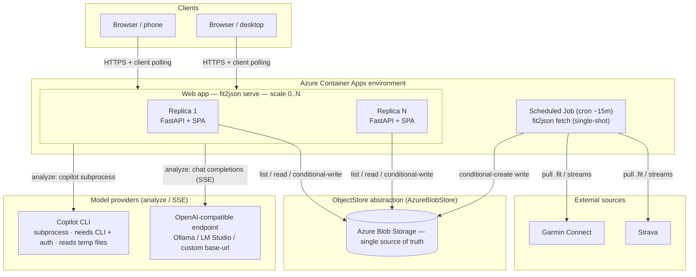
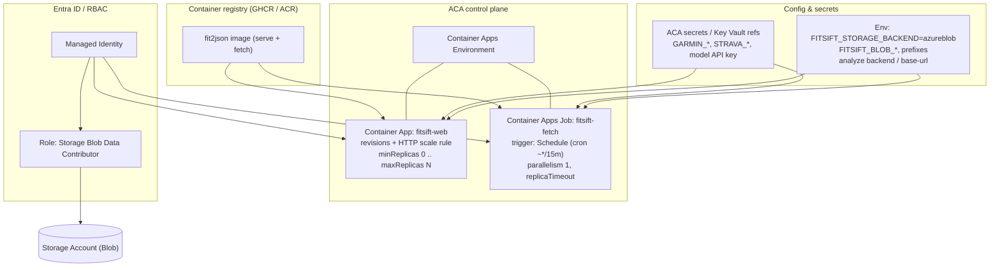
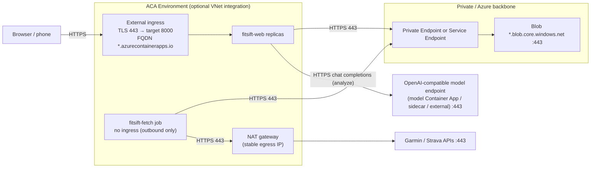
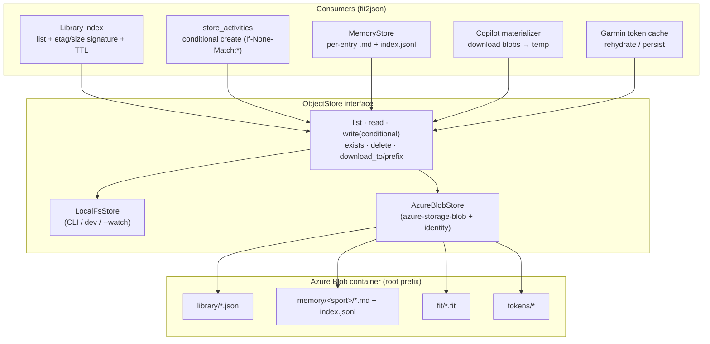
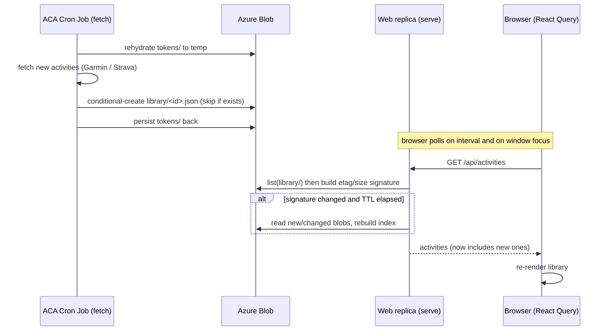
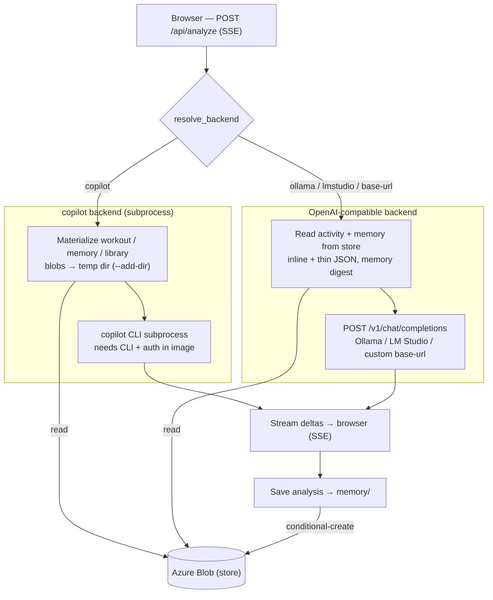

# Multi-user sync for Azure Container Apps

**Status:** planning · **Scope now:** single-owner, many replicas/browsers consistent ·
**Scope later:** true per-user multi-tenancy (non-breaking).

This document is the tracked, editable source of truth for the sync/storage rework. It
captures the problem, the confirmed decisions, the target architecture (with diagrams), a
phased plan, and the key trade-offs.

---

## 1. Problem

`fit2json` / FitSift stores everything on the **local filesystem**:

- a single global workout **library** (`library_dir`, one lossless JSON per activity), and
- a training-**memory** corpus (`memory_dir`, `.md` files + `index.jsonl`).

The web app's `Library` index is a **per-process** cache, rebuilt from an `rglob` + file-mtime
signature (`web/services.py`). The `--watch` poller is a single in-process loop (`watch.py`).
There is **no user/tenant concept** and **no cross-replica coordination**.

In Azure Container Apps (ACA) this breaks along several axes:

| Axis | Today | Why it breaks in ACA |
|------|-------|----------------------|
| Durability | Data on local disk | Replica disks are **ephemeral**; lost on restart/scale |
| Sharing | One process, one disk | Replicas **don't share** a filesystem |
| Index cache | Per-process, mtime signature | Each replica has its **own** cache; never sees others' writes |
| Poller | Single in-process `--watch` | Doesn't fit scale-to-zero; per-replica pollers **double-fetch / race** |
| Live UI | React Query, 30s stale, no focus refetch, no push | Browser never learns **new data landed** |
| Writes | Read-modify-write dedup | **Races** across job + web writers on shared storage |

---

## 2. Confirmed decisions

- **Scope:** optimize now for **single-owner, many replicas/browsers staying consistent**;
  design so a later move to **true per-user multi-tenancy** isn't blocked.
- **Shared storage:** **Azure Blob Storage** — rewrite the storage layer behind an
  abstraction; keep a local-filesystem implementation for the CLI, local dev, and `--watch`.
- **Poller:** an **ACA Scheduled Job (cron)** that runs a single-shot `fetch` per trigger
  (no long-lived loop in ACA). `--watch` stays for local use.
- **Live UI:** **client polling** via React Query (periodic refetch + refetch on focus) —
  replica-agnostic, works with Blob, no shared pub/sub needed.

---

## 3. Approach

Introduce an `ObjectStore` abstraction with `LocalFsStore` (current behavior) and
`AzureBlobStore` implementations, then route every storage consumer through it:
`web/services.py` (`Library`, `store_activities`, `fetch_and_store`), `memory.py`
(`MemoryStore`), the CLI write/read path, the Garmin token cache, and the copilot analyze
path (which needs real local files, so it **materializes** blobs to a temp dir on demand).

Key correctness properties:

- **Race-safe dedup / writes** via conditional create (`If-None-Match: *`); re-fetch/re-upload
  is a natural no-op across the cron job and web ingest.
- **Cross-replica coherence** via a `list()`-based signature (key + etag + size) with a short
  TTL so bursts reuse the cached index but replicas converge within seconds.
- **Race-free memory** by writing per-entry immutable `.md` blobs (unique keys); the
  `index.jsonl` becomes a rebuildable cache (services already scan `.md` as source of truth)
  or an Append Blob.
- **Future multi-tenancy:** all keys sit under a configurable root prefix, so a
  `users/{uid}/…` segment can be prepended later with no structural change.

---

## 4. Architecture

### 4.1 Overview — deployment topology



Blob container key layout (all under a configurable root prefix so a `users/{uid}/` segment
can be prepended later for multi-tenancy):

```
<root>/
├── library/   one lossless workout JSON per activity   (source of truth for the UI)
├── memory/    <sport>/<id>_<hash>.md analyses + index.jsonl (rebuildable cache)
├── fit/       raw .fit archive (incremental dedup)
└── tokens/    Garmin/garth session cache (rehydrated by the cron Job)
```

### 4.2 Control layer — orchestration, identity & config

Who deploys, scales, and schedules what; and how each workload authenticates to Blob
(managed identity + RBAC) instead of connection strings.



### 4.3 Networking layer — ingress, egress & boundaries

Inbound TLS to the web app only; the Job has no ingress. Both reach Blob over 443 (private
endpoint preferred); the Job egresses to Garmin/Strava, optionally via a NAT gateway for a
stable outbound IP (helps with rate-limiting/allowlists). For **analyze**, the web app either
spawns the Copilot CLI as an in-container subprocess (only if the CLI is installed +
authenticated in the image) or egresses over HTTPS to an OpenAI-compatible model endpoint —
a dedicated model Container App, a sidecar, or an external service (the `localhost` Ollama /
LM Studio defaults won't exist in the container).



### 4.4 Storage layer — ObjectStore abstraction & Blob internals

Every consumer goes through one interface with two implementations; consistency comes from
conditional-create writes and a `list()`-based signature with a short TTL.



### 4.5 Data-flow — sync / consistency



### 4.6 Analysis / model-provider flow

`POST /api/analyze` streams (SSE) from one of three backends resolved per request. The
**copilot** backend runs the `copilot` CLI as a subprocess and reads the workout, memory, and
(for freeform) the whole library **by local path** — so with Blob those blobs are first
**materialized to a temp dir**. The **ollama / lmstudio / custom base-url** backends instead
read the activity + memory from the store, **inline and thin** the JSON, and call an
OpenAI-compatible endpoint. Either way the final analysis is saved back to `memory/`.



---

## 5. Plan of work

### Phase 0 — Persistent planning doc
- **`repo-plan-doc`** — Create this file (`docs/multi-user-sync.md`) with the full plan and
  all six diagrams as the repo-tracked, editable source of truth. ✅ (this document)

### Phase 1 — Storage abstraction (core)
1. **`storage-interface`** — Define `ObjectStore` + `ObjectInfo` (key, etag, size,
   last_modified): `list(prefix)`, `read_bytes/read_text`, `write_bytes(conditional
   create/overwrite)`, `exists`, `delete`, `download_to`, `download_prefix`. New package
   `src/fit2json/storage/`.
2. **`storage-local`** — `LocalFsStore`: map keys → paths under a root; implement all ops
   (conditional create via atomic `open(x)`), preserving today's on-disk layout.
3. **`storage-azureblob`** — `AzureBlobStore` on `azure-storage-blob`: container + prefix,
   ETag conditional writes, `DefaultAzureCredential` (managed identity) or connection string.
4. **`storage-factory`** — `get_store()` resolving backend from settings; add settings fields
   + root-prefix handling (multi-tenant-ready).

### Phase 2 — Route consumers through the store
5. **`services-library`** — `Library` indexes via `store.list()` + etag/size signature with a
   short TTL; reads activities via the store.
6. **`services-write`** — `store_activities` writes via conditional create (race-safe dedup);
   `fetch_and_store` unchanged logic but store-backed.
7. **`memory-store`** — `MemoryStore` uses the store; per-entry `.md` unique keys; index as
   rebuildable cache / Append Blob; update `_all_memory_entries`, `_entry_body`, `read_entry`.
8. **`output-write`** — Web write path calls the store directly; keep `output.py` filesystem
   behavior for the CLI (`convert`/`fetch` to `-o`).

### Phase 3 — Copilot analyze with non-local storage
9. **`analyze-materialize`** — Helper to download selected workout(s) / memory / library to a
   temp dir; update the `analyze` route + `generate_workout_analysis` to pass temp paths and
   clean up. Note freeform-over-whole-corpus cost + future replica-local mirror optimization.

### Phase 4 — Poller as an ACA cron job
10. **`poller-tokens`** — Persist/rehydrate the Garmin token cache through the store around a
    single-shot `fetch` so the cron job resumes the session (avoids CAPTCHA/rate limits).
11. **`poller-fetch`** — Ensure CLI `fetch` (single-shot) and `fetch_and_store` write through
    the store when backend=azureblob; `--watch` retained for local.

### Phase 5 — Frontend client polling
12. **`fe-polling`** — React Query defaults / list queries: `refetchOnWindowFocus: true` +
    `refetchInterval` for `['activities']` and memory lists; a quiet, on-brand "syncing"
    affordance (respect `DESIGN.md`: minimal, no flashy motion).

### Phase 6 — Config, deps, deployment, docs, tests
13. **`config-env`** — Settings/env: `FITSIFT_STORAGE_BACKEND` (`local`|`azureblob`),
    `FITSIFT_BLOB_*` (account URL/container/prefix or connection string); `.env.example`.
14. **`deps-docker`** — Add `azure-storage-blob` + `azure-identity` optional extra; update the
    Dockerfile to install the `web` (+`azure`) extras so `serve` runs in-image.
15. **`docs-aca`** — README: ACA topology (web container + Blob via managed identity, the cron
    Job for fetch, token-cache persistence, env vars); single-owner-now / multi-tenant-later.
16. **`tests`** — Store interface (local + in-memory fake), conditional-create dedup, signature
    TTL invalidation, memory read/scan, copilot materialization; run `ruff` + `pytest`.

---

## 6. Notes / considerations

- **Copilot backend needs real files _and_ the CLI.** The copilot analyzer takes
  `workout_paths`, `memory_dir`, `library_dir` as **local paths**; with Blob these must be
  materialized to a temp dir per request (documented trade-off; future: a replica-local
  read-through mirror). It also shells out to the `copilot` CLI, which is **not in the
  container image today** (README: run analysis on a host) — to use it in ACA you'd install +
  authenticate the CLI in the image; otherwise analyze should use an OpenAI-compatible endpoint.
- **Local LLMs aren't `localhost` in ACA.** `ollama` / `lmstudio` default to
  `http://localhost:11434|1234/v1`, which won't exist in the web container. Point the analyze
  backend at a reachable OpenAI-compatible service (a dedicated model Container App, a sidecar,
  or an external endpoint) via `--base-url` / config.
- **`index.jsonl` append isn't concurrency-safe.** Prefer immutable per-entry `.md` blobs +
  a rebuildable index (or Append Blob) to avoid corruption across the job + web writers.
- **TTL vs. freshness.** Client polling drives periodic refetch, so a ~10–15s index-list TTL
  balances Blob list latency/cost against cross-replica convergence.
- **No auth is added now.** Multi-tenancy (identity + per-user prefixes/credentials + a poller
  per user) is explicitly deferred; the key-prefix design keeps it a non-breaking addition.

## 7. Out of scope (for now)

- Authentication / authorization.
- Per-user Garmin/Strava credentials and a poller per user.
- Server-push live updates (SSE/WebSocket + shared pub/sub).
- Infrastructure-as-code (bicep/terraform) beyond README guidance.
