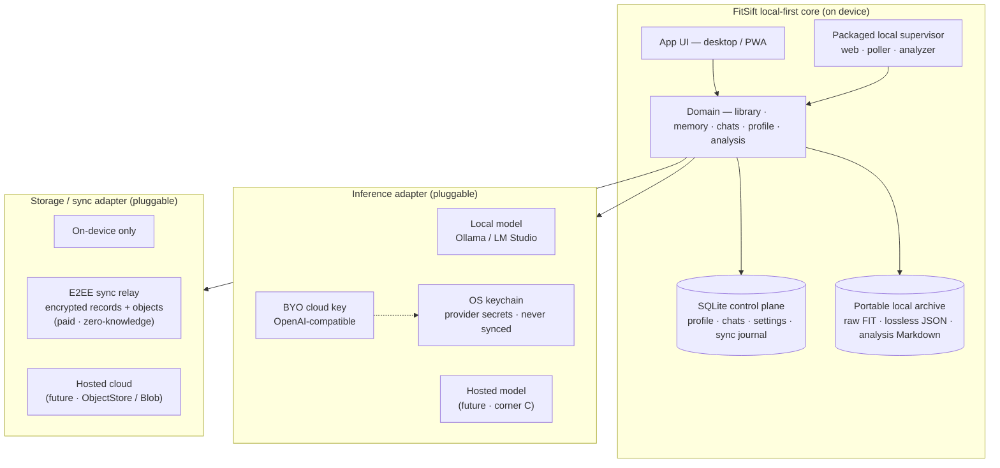

# Product direction — local-first, private AI coach

**Status:** direction (owner-approved; revalidated after merging `main` on 2026-07-31) ·
**supersedes** the hosted multi-tenant plan in `docs/multi-user-sync.md`, which is now
parked as an optional future *hosted adapter*.

---

## Thesis

> **A private AI coach for endurance athletes.** Your complete training history — losslessly
> yours, in a local vault on your device — analyzed by the model *you* choose (fully local,
> or your own cloud key). The **anti-Strava**: no feed, no kudos, no engagement mechanics;
> just quiet, deep insight that *remembers* your training over time.

## Who it's for (ICP)

- **Primary:** serious amateur runners / cyclists / triathletes who want deep, private insight
  into their *own* full history — underserved by shallow, privacy-eroding AI (Strava Athlete
  Intelligence, Whoop, Oura).
- **Revenue wedge:** **coaches** — multi-athlete, need history + depth, willing to pay.
- **Kept, not chased:** the privacy / local-LLM hardcore — served by the defaults, not the pitch.

## The trilemma, chosen by the user

You can't have all three at once — but we let each user pick their **two**, because two of the
three corners are the *same* build:

| Corner (what it sacrifices) | Storage | Inference | Build |
|---|---|---|---|
| **A · Private + Frontier** (sacrifices Easy) | local / E2EE | **BYO cloud key** | **now — core** |
| **B · Private + Easy** (sacrifices Frontier) | local / E2EE | **local model** | **now — core** |
| **C · Frontier + Easy** (sacrifices Privacy) | our cloud | hosted model | later — *adapter* |

- **A and B are one local-first app + a model toggle** the analyzer already supports
  (`copilot` / local / `--base-url`). They ship together, day one, and span the entire
  privacy-caring market ("bring your key for quality" *or* "stay fully local").
- **C is the only architecturally different corner** (our cloud, data leaves the device). It is
  added later as a **pluggable hosted adapter** via the `ObjectStore` seam — the parked
  `docs/multi-user-sync.md` plan **repurposed, not discarded**.

## Architecture principle — one core, two pluggable axes

The trilemma position is **configuration**, not a fork in the codebase.

- **Inference adapter:** local model ↔ BYO cloud key ↔ *(later)* hosted model.
- **Storage / sync adapter:** on-device ↔ E2EE sync relay (paid) ↔ *(later)* hosted cloud.
- Corner mapping: **A** = (S1/S2 + I2) · **B** = (S1/S2 + I1) · **C** = (S3 + I3).

## What the latest `main` already gives us

The local-first direction is now closer to the code than when this document was written:

- `scripts/fitsift local` supervises the **web UI, Garmin poller, and auto-analyzer** as
  local host processes, preserving access to the Copilot CLI and localhost model servers.
- `analyze --watch` incrementally analyzes new workouts and de-duplicates against the memory
  index — the on-device automation loop already exists.
- The product now persists **chat sessions** (`~/.fit2json/chats/*.json`) and an **athlete
  profile** (`~/.fit2json/profile.json`) in addition to workouts and analysis memory.
- Analyze is chat-first and resumable, with backend/model selection and an optional visual
  infographic pass.

`ARCHITECTURE.md` documents this current three-role filesystem pipeline. The next step is to
**package and consolidate it**, not replace its working behavior.

## Design adjustments after the merge

1. **Use a hybrid local vault, not one monolithic SQLite file.** SQLite should own mutable,
   transactional state (profile, chats/messages, provider references, settings, sync journal).
   Keep raw `.fit`, lossless workout JSON, and human-readable analysis Markdown as portable
   files. This preserves the product's lossless/exportable promise and avoids syncing a live
   SQLite database file between devices.
2. **Package the existing three-role pipeline.** The poller/analyzer/web separation is proven;
   an installable app should hide the supervisor/PID/process details behind one lifecycle and
   one status surface rather than rewrite them into one process immediately.
3. **Sync the whole vault, not only workouts.** E2EE sync must cover archive objects plus
   profile, chats, memories, and non-secret preferences. Provider credentials stay in each
   device's OS keychain and are never synced.
4. **BYO cloud inference is not productized yet.** The CLI supports `--base-url` + `--api-key`,
   but the web API/UI exposes only Copilot, Ollama, and LM Studio. Corner A needs a provider
   settings UX, endpoint validation, and local secret storage.
5. **Background analysis must be explicit and cost-aware.** `analyze --watch` can spend a
   user's cloud-model budget automatically. Default it off until a provider is configured;
   show the selected provider/model and let the user set limits or choose manual-only mode.
6. **Copilot CLI remains a local owner/developer adapter.** `fitsift local` now proves that
   integration end-to-end, but it is not the mainstream onboarding path.

## Positioning guardrails

1. **Sharp default + headline: local-first, private.** "Pick any two" is the *capability*, not
   the *pitch* — a product that markets itself as everything stands for nothing.
2. **Per-mode honesty.** The UI states each mode's privacy posture; choosing a hosted mode
   plainly says *"this stores your data on our servers / sends it to a cloud model."*
3. **Contain the 3× surface.** Sequence delivery; don't ship all corners at once.

## Monetization (no resale, no token markup)

- **Free:** local-first, single-device (corners A / B).
- **Paid:** **E2EE sync** — multi-device + backup, à la Obsidian Sync. The primary paywall.
- **Pro / coach:** multi-athlete, sharing, advanced features.
- **Optional later:** hosted convenience edition (corner C).
- We never touch model cost or user data in the paid core → **high margin, low risk, honest**.

## Phased sequence

1. **Package the local-first vault and runtime.** Turn today's `fitsift local` pipeline into an
   installable desktop/PWA experience. Add SQLite for mutable control-plane state while
   retaining the portable workout/memory archive; migrate profile + chats behind repositories.
2. **Finish corners A + B.** Add a first-class inference adapter/config UI for local models and
   arbitrary OpenAI-compatible BYO providers. Store secrets in the OS keychain, label privacy
   boundaries, and make auto-analysis opt-in/cost-aware.
3. **E2EE sync (paid).** Sync encrypted records + immutable archive objects through a
   zero-knowledge relay; add key management + recovery (data-loss UX is the real risk here).
4. **Coach / sharing.** Multi-athlete via E2EE sharing.
5. **Optional hosted adapter (corner C).** Only if mainstream demand proves out; reuse the
   `ObjectStore` seam from the parked plan — additive, not a rewrite.

## Non-goals

- Consumer-social patterns (feeds, kudos, leaderboards, streaks).
- Reselling inference / token markup / being a billing intermediary.
- A cloud that can read your data in the private tiers.

## Related docs

- `PRODUCT.md` — brand & positioning (updated for local-first + broader audience).
- `ARCHITECTURE.md` — current implementation: local web/poller/analyzer roles coordinated
  through `~/.fit2json`.
- `docs/multi-user-sync.md` — **parked**; now the blueprint for the optional hosted adapter
  (corner C).
