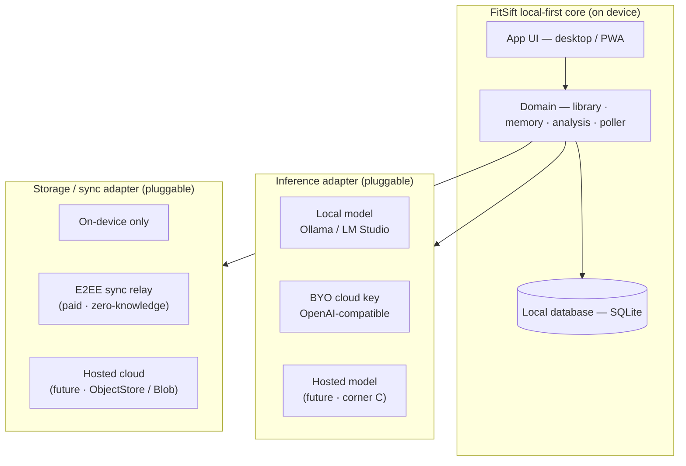

# Product direction — local-first, private AI coach

**Status:** direction (owner-approved) · **supersedes** the hosted multi-tenant plan in
`docs/multi-user-sync.md`, which is now parked as an optional future *hosted adapter*.

---

## Thesis

> **A private AI coach for endurance athletes.** Your complete training history — losslessly
> yours, in a local database — analyzed by the model *you* choose (fully local, or your own
> cloud key). The **anti-Strava**: no feed, no kudos, no engagement mechanics; just quiet,
> deep insight that *remembers* your training over time.

## Who it's for (ICP)

- **Primary:** serious amateur runners / cyclists / triathletes who want deep, private insight
  into their *own* full history — underserved by shallow, privacy-eroding AI (Strava Athlete
  Intelligence, Whoop, Oura).
- **Revenue wedge:** **coaches** — multi-athlete, need history + depth, willing to pay.
- **Kept, not chased:** the privacy / local-LLM hardcore — served by the defaults, not the pitch.

## The trilemma, chosen by the user

You can't have all three at once — but we let each user pick their **two**, because two of the
three corners are the *same* build:

| Corner (what it sacrifices) | Storage | Inference | Build |
|---|---|---|---|
| **A · Private + Frontier** (sacrifices Easy) | local / E2EE | **BYO cloud key** | **now — core** |
| **B · Private + Easy** (sacrifices Frontier) | local / E2EE | **local model** | **now — core** |
| **C · Frontier + Easy** (sacrifices Privacy) | our cloud | hosted model | later — *adapter* |

- **A and B are one local-first app + a model toggle** the analyzer already supports
  (`copilot` / local / `--base-url`). They ship together, day one, and span the entire
  privacy-caring market ("bring your key for quality" *or* "stay fully local").
- **C is the only architecturally different corner** (our cloud, data leaves the device). It is
  added later as a **pluggable hosted adapter** via the `ObjectStore` seam — the parked
  `docs/multi-user-sync.md` plan **repurposed, not discarded**.

## Architecture principle — one core, two pluggable axes

The trilemma position is **configuration**, not a fork in the codebase.

- **Inference adapter:** local model ↔ BYO cloud key ↔ *(later)* hosted model.
- **Storage / sync adapter:** on-device ↔ E2EE sync relay (paid) ↔ *(later)* hosted cloud.
- Corner mapping: **A** = (S1/S2 + I2) · **B** = (S1/S2 + I1) · **C** = (S3 + I3).

## Positioning guardrails

1. **Sharp default + headline: local-first, private.** "Pick any two" is the *capability*, not
   the *pitch* — a product that markets itself as everything stands for nothing.
2. **Per-mode honesty.** The UI states each mode's privacy posture; choosing a hosted mode
   plainly says *"this stores your data on our servers / sends it to a cloud model."*
3. **Contain the 3× surface.** Sequence delivery; don't ship all corners at once.

## Monetization (no resale, no token markup)

- **Free:** local-first, single-device (corners A / B).
- **Paid:** **E2EE sync** — multi-device + backup, à la Obsidian Sync. The primary paywall.
- **Pro / coach:** multi-athlete, sharing, advanced features.
- **Optional later:** hosted convenience edition (corner C).
- We never touch model cost or user data in the paid core → **high margin, low risk, honest**.

## Phased sequence

1. **Local-first core (A + B).** Installable app (desktop / PWA), local DB, inference toggle
   (local / BYO key), on-device poller. Honest and close to shippable — it *productizes* today's
   CLI + local `serve` + local files rather than rebuilding them.
2. **E2EE sync (paid).** Zero-knowledge relay; key management + recovery (data-loss UX is the
   real risk here); multi-device.
3. **Coach / sharing.** Multi-athlete via E2EE sharing.
4. **Optional hosted adapter (corner C).** Only if mainstream demand proves out; reuses the
   `ObjectStore` seam from the parked plan — additive, not a rewrite.

## Non-goals

- Consumer-social patterns (feeds, kudos, leaderboards, streaks).
- Reselling inference / token markup / being a billing intermediary.
- A cloud that can read your data in the private tiers.

## Related docs

- `PRODUCT.md` — brand & positioning (updated for local-first + broader audience).
- `docs/multi-user-sync.md` — **parked**; now the blueprint for the optional hosted adapter
  (corner C).
